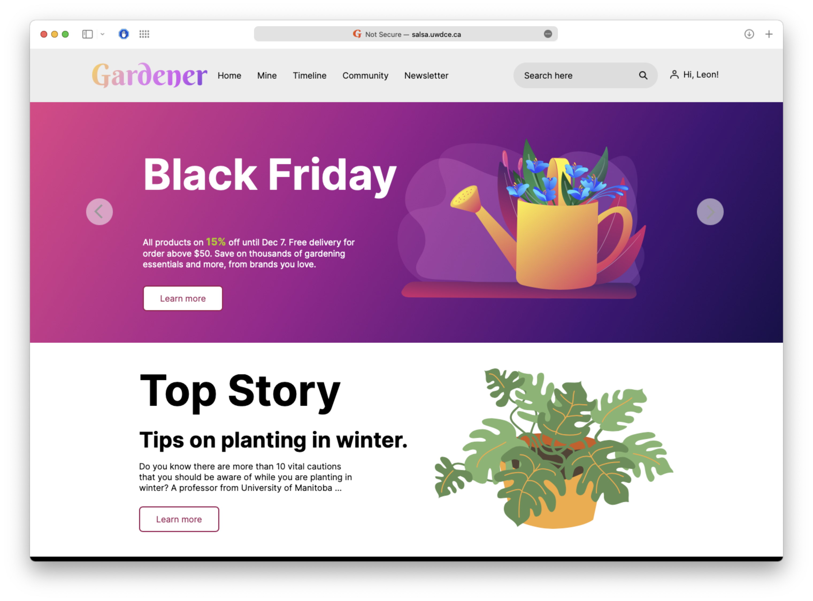

#Readme

# Programming Basics - Lihang Yao

## Description 
---
This is my description:

* Basic programming skills in C, C++, JAVA for around one or two semesters.
* Study in Digital Media Program before.
* Barely working with code after graduate.

## My HTML Capstone
---


## Code Samples
---
### HTML
```
<nav> 
        <ul id="navlist">
          <li><a target="_blank" href="./index.html" title="Gardener Home">Home</a></li>
          <li><a target="_blank" href="./mine.html" title="Gardener Mine tells you items you owns">Mine</a></li>
          <li><a target="_blank" href="./timeline.html" title="Gardener Timeline shows your tracking of your plants">Timeline</a></li>
          <li><a target="_blank" href="./community.html" title="Gardener Community shows what other people is doing">Community</a></li>
          <li><a target="_blank" href="./newsletter.html" title="Click and subscribe our newsletter weekly">Newsletter</a></li>
        </ul>
</nav>
```

### CSS
```
nav ul#navlist li a{
  text-decoration: none;
  color: #000;
/*  background-color: rgba(255,255,255,60%);*/
/*  background-color: rgba(0,0,0,60%);*/
  background-color: rgba(0,0,0,0);
  display: block;
  padding: 13px 11px 12px 14px;
  min-width: 50px;
  text-align: center;
  -webkit-transition: all .3s ease-in-out;
  transition: all .3s ease-in-out;
}
```

## Programming Tutorials
---
* [Introduction to Programming and Computer Science - Full Course](https://youtu.be/zOjov-2OZ0E)
* [Learn web development as an absolute beginner (2021)](https://coder-coder.com/learn-web-development/)
